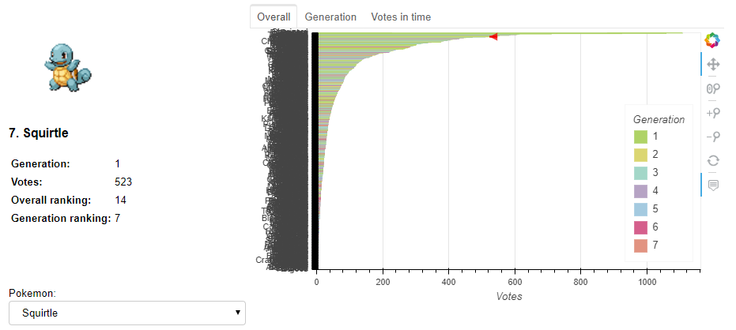

# Interactive Visualization of the "Who is your favorite Pok&eacute;mon" Survey Results

The newest entries of the Pok&eacute; main series, [Pok&eacute;mon Sword and Pok&eacute;mon Shield](http://swordshield.pokemon.com/en-us/), will be released later this year. However, the new generation of pocket monsters came with the news that [you won't be able to complete the national Pok&eacute;dex](http://www.nintendolife.com/news/2019/06/you_cannot_have_a_complete_national_pokedex_in_pokemon_sword_and_shield). In other words, you won't be able to capture _all_ the Pok&eacute;mon from previous 7 generations.

In a series where "Gotta catch'em all" is its catch phrase, this caused a huge backslash by some members of the community1. Their main argument was that "every Pok&eacute;mon is someone's favorite". In order to test this, reddit user [`mamamia1001`](https://www.reddit.com/user/mamamia1001/) created a survey to record Pok&eacute;mon preference. (S)he also [analyzed the survey results and made the dataset public](https://www.reddit.com/r/pokemon/comments/c0w4s0/favourite_pok%C3%A9mon_survey_results/). In this project, I created an interactive dashboard using [Bokeh](https://bokeh.pydata.org/en/latest/index.html) to visualize the results of the survey. 

**You can find the interactive visualization here** 
 (be patient, it can take a while to load). 
 
It looks something like this:

It allows you to choose whatever Pok&eacute;mon you want and see its preference ranking compared to all Pok&eacute;mon, compared to all Pok&eacute;mon of its generation, and how did people voted for it in time during the period in which the survey was open (notice how the color of that plot corresponds to the Pok&eacute;mon's dominant color)

If you are interested in a more detailed (although more static) analysis of the data, please check out [my other repository](https://github.com/arturomoncadatorres/favorite-pokemon).

A big shout out to [@bryevdv](https://github.com/bryevdv) for helping me with a [few issues I had with Bokeh legends](https://discourse.bokeh.org/t/cant-order-legend-entries-in-hbar-plot/3816) and to [@betatim](https://github.com/betatim) and [@jdkent](https://github.com/jdkent) for [helping me deploying the Bokeh app in Binder](https://discourse.jupyter.org/t/creating-a-shareable-bokeh-dashboard-with-binder/1962). The latter isn't so trivial. Thus I wrote a small post with the required steps to do so, which [you can find here](http://www.arturomoncadatorres.com/creating-a-shareable-bokeh-dashboard-with-binder/). If you have any comments or suggestions, feel free to raise an issue here [or drop me a line in Twitter (@amoncadatorres)](http://www.twitter.com/amoncadatorres).